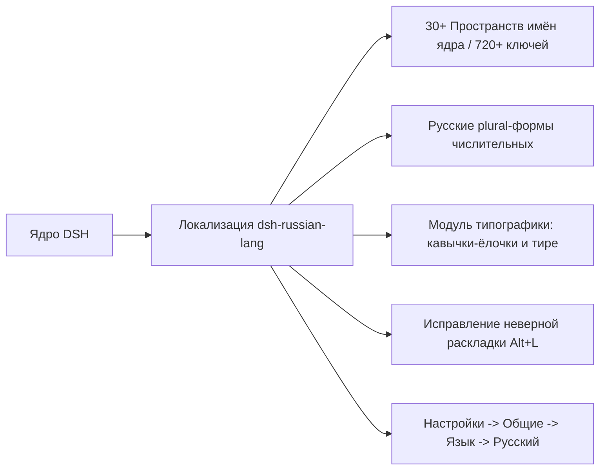

# 📦 @goodandready/dsh-russian-lang

<div align="center">

<h3>Полная русская локализация веб-интерфейса DeepSeek Harness</h3>

<p align="center">
  <a href="https://www.npmjs.com/package/@goodandready/dsh-russian-lang"></a>
  <a href="LICENSE"></a>
  <a href="https://github.com/topics/dsh-plugin"></a>
  <a href="https://nodejs.org"></a>
</p>

</div>

---

Полный нативный пакет русской локализации веб-интерфейса **DeepSeek Harness** со встроенным модулем типографики, исправлением неверной раскладки клавиатуры и поддержкой русских форм множественного числа (plural-форм).



## ✨ Ключевые возможности

* **Полное покрытие ядра**: переведено более 30 пространств имён ядра DSH (720+ ключей локализации), включая `common`, `conversation`, `settings`, `settings.models`, `workspace`, `subagent`, `reference`, системные статусы и карточки плагинов.
* **Нативная интеграция в селектор языков**: добавляет пункт **«Русский»** прямо в меню **Настройки → Общие → Язык** и синхронизирует `<html lang="ru-RU">` без модификации и патчинга исходных файлов ядра.
* **Русские plural-формы**: обёртка `translate` корректно обрабатывает грамматические формы числительных (`один / несколько / много`).
* **Модуль типографики (`russian-lang.typography`)**: автоматическая расстановка кавычек-«ёлочек», длинных тире и неразрывных пробелов после коротких предлогов (не затрагивает блоки кода и моноширинные поля).
* **Исправление ошибочной раскладки (`Alt+L`)**: интеллектуальное распознавание текста, набранного латиницей вместо кириллицы (например, `ghjtrn` → `проект`), с выводом интерактивной подсказки над строкой ввода и горячей клавишей <kbd>Alt+L</kbd>.
* **Пользовательские переопределения**: возможность переопределить любой системный ключ перевода через пространство настроек `russian-lang.overrides`.
* **Проверка орфографии**: автоматическая активация браузерного словаря `spellcheck` для русскоязычных текстовых полей.

## 📦 Установка

```bash
dsh plugin --profile web add @goodandready/dsh-russian-lang
```

После установки выберите: **Настройки → Общие → Язык → Русский** и обновите страницу.

## 📄 Лицензия

MIT © [GooDAnDReaDY](https://github.com/GooDAnDReaDY)
